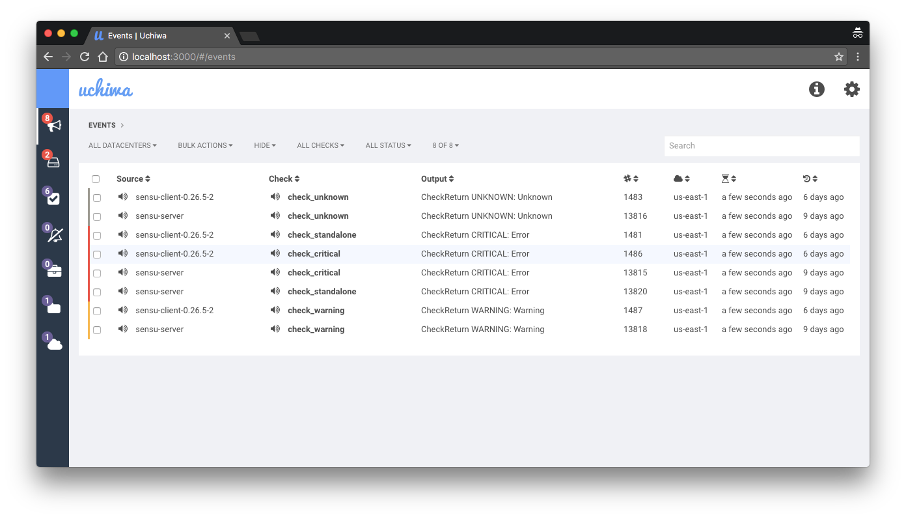

# Uchiwa
*Uchiwa* is a simple yet effective open-source dashboard for the Sensu monitoring framework.

This repository contains the backend, written in Go.
See [uchiwa-web](https://github.com/sensu/uchiwa-web) for the AngularJS web frontend.

## Installation
See [Uchiwa Docs](https://docs.sensu.io/uchiwa/latest/getting-started/installation/).

## Configuration
See [Uchiwa Docs](https://docs.sensu.io/uchiwa/latest/getting-started/configuration/).

## Contributing
See [Uchiwa Docs](https://docs.sensu.io/uchiwa/latest/contributing/).

## Credits
* Author & Maintainer: [Simon Plourde][author]
* Maintainer: [Justin Kolberg][amdprophet]
* [Contributors](https://github.com/sensu/uchiwa/graphs/contributors)

## License
MIT (see [LICENSE][license])

[author]:                 https://github.com/palourde
[license]:                https://github.com/sensu/uchiwa/blob/master/LICENSE
[amdprophet]:             https://github.com/amdprophet
